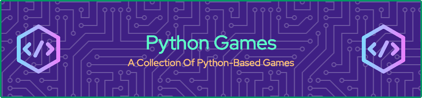

## Overview.

This is a two-player game of pong that is based off of the classic arcade game. A video demo of the game can be watched on YouTube by clicking on the image below:

[](https://youtu.be/zIPcXI_onnI)

## Requirements.

This application was created and tested using Python 3.8.13. Please ensure you have this version (or higher) installed.

The required libraries and modules used byt this program, mainly Time and Turtle are built into Python3.

You will also need the GitHub CLI installed to be able to clone the repository. Details on how to install it can be found [here](https://github.com/cli/cli "GitHub CLI")

Details about what each file in the folder does can be found [here](about-the-files.md/ "Files").

## How To Run The Game.

### Step 1. Clone The Repository.
First, clone the repository to a location on your local system.

1. Open a terminal.
2. Change to the directory where you would like to clone the repository to.
3. Run the below command to clone the repository:
   ```shell-script
   gh repo clone York13Pud/python-games 
   ```
   
4. Run the below command to change to the pong application directory:
   ```shell-script
   cd python-games/pong
   ```

### Step 2. Running The Application.

Once the repository has been cloned, you can now run the application. To start the application do the following:

1. In the same terminal, execute the following:
   ```shell-script
   python3 ./app.py
   ```
The application will then appear and you can start using it.


## How To Play.

Once the program is running, you can start a game between two players. The controls for each player are:

| | Left Player | Right Player |
| ---| --- | --- |
| Move Up | Q | Up Arrow |
| Move Down | A | Down Arrow |

The ball with launch automatically.

May the best player win!!